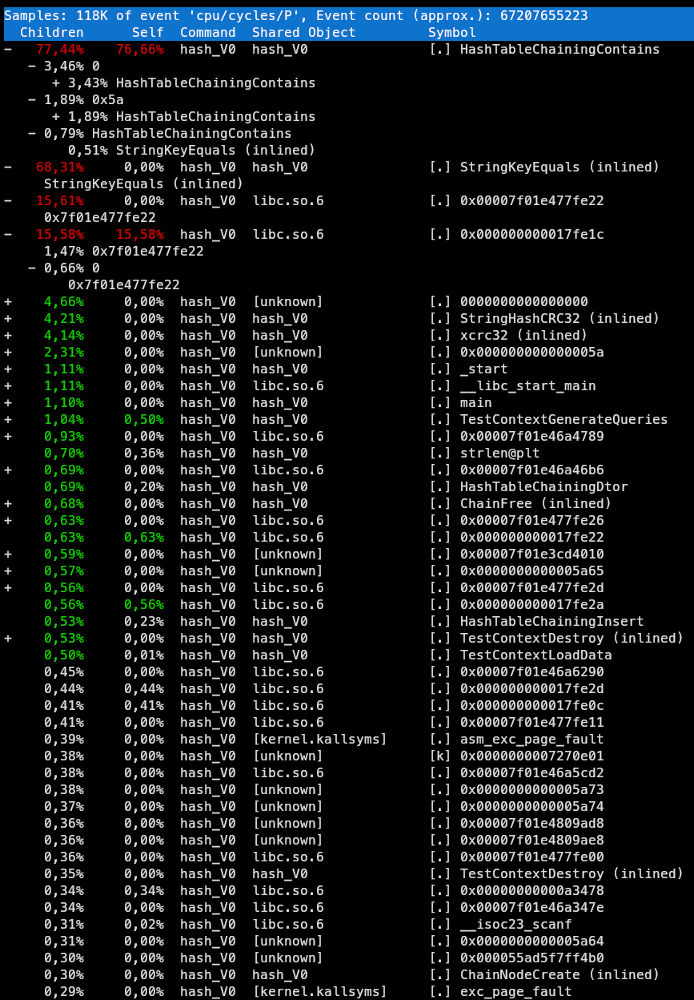
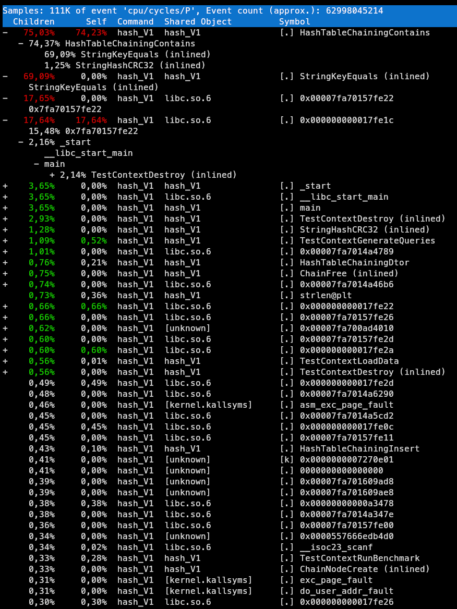
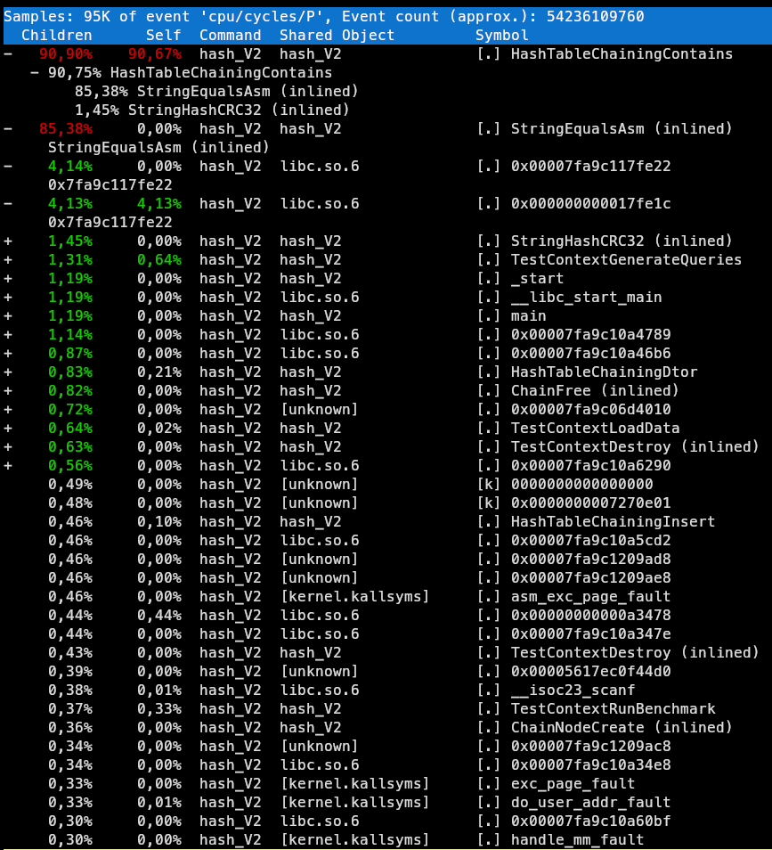

# Отчет

## Результаты замеров

### V0

Команда для запуска:
```bash
sudo perf record -g nice -n -20 taskset -c 3 ./hash_V0 < data.txt
```



Рисунок 1. Скрин из `perf record`

Результаты замеров:
```
Preparing 5000000 requests...
Starting the search measurement (5 runs)...
[Run 1] Найдено: 2500000 | Тактов: 12209709832 | На поиск: 2441
[Run 2] Найдено: 2500000 | Тактов: 12283433398 | На поиск: 2456
[Run 3] Найдено: 2500000 | Тактов: 12500975022 | На поиск: 2500
[Run 4] Найдено: 2500000 | Тактов: 12507205614 | На поиск: 2501
[Run 5] Найдено: 2500000 | Тактов: 12532041836 | На поиск: 2506

--- Итоговая статистика ---
Отброшены: max = 12532041836, min = 12209709832
Среднее число тактов на запуск (по 3 валидным прогонам): 12430538011
Среднее число тактов на 1 поиск: 2486
```

### V1

Команда для запуска:
```bash
sudo perf record -g nice -n -20 taskset -c 3 ./hash_V1 < data.txt
```



Рисунок 2. Скрин из `perf record`

Результаты замеров:
```
Preparing 5000000 requests...
Starting the search measurement (5 runs)...
[Run 1] Найдено: 2500000 | Тактов: 11594944396 | На поиск: 2318
[Run 2] Найдено: 2500000 | Тактов: 11599628004 | На поиск: 2319
[Run 3] Найдено: 2500000 | Тактов: 11779950490 | На поиск: 2355
[Run 4] Найдено: 2500000 | Тактов: 11600891638 | На поиск: 2320
[Run 5] Найдено: 2500000 | Тактов: 11601100174 | На поиск: 2320

--- Итоговая статистика ---
Отброшены: max = 11779950490, min = 11594944396
Среднее число тактов на запуск (по 3 валидным прогонам): 11600539938
Среднее число тактов на 1 поиск: 2320
```

### V2

Команда для запуска:
```bash
sudo perf record -g nice -n -20 taskset -c 3 ./hash_V1 < data.txt
```



Рисунок 3. Скрин из `perf record`

Результаты замеров:
```
Preparing 5000000 requests...
Starting the search measurement (5 runs)...
[Run 1] Найдено: 2500000 | Тактов: 9829457190 | На поиск: 1965
[Run 2] Найдено: 2500000 | Тактов: 9842420400 | На поиск: 1968
[Run 3] Найдено: 2500000 | Тактов: 10091120938 | На поиск: 2018
[Run 4] Найдено: 2500000 | Тактов: 9790546738 | На поиск: 1958
[Run 5] Найдено: 2500000 | Тактов: 9783542738 | На поиск: 1956

--- Итоговая статистика ---
Отброшены: max = 10091120938, min = 9783542738
Среднее число тактов на запуск (по 3 валидным прогонам): 9820808109
Среднее число тактов на 1 поиск: 1964
```


